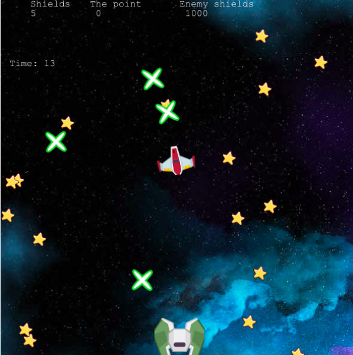

# Shooter Game

This is the capstone project on Microverse curriculum for JS. Here I've built a browser game which is a spaceship shooter game with Phaser. 

<br>

## Built With

- JavaScript
- Phaser
- WebPack
- Babel
- ESLint
- StyleLint
- Microverse Leaderboard API

## Prerequisities

To get this project up and running locally, you must have node installed on your local machine.

## Live Link

Here is the [live link](https://sharp-lamport-8a5538.netlify.app/)

## Important Notice

- The initial blank screen take a bit long, because the audio file is big enough to slow-down the network request.
- Rİght now it gives a cors error but I've configured the app with no cors policy. There must be a problem with the API.


## Getting Started

**Setup**

- Clone this repository with ```git clone git@github.com:eypsrcnuygr/shooter-game.git``` using your terminal or command line.<br>
- Change to the project directory by entering ```cd shooter-game``` in the terminal<br>
- Next run ```yarn``` to install the necessary dependencies<br>
- Run ```yarn run watch``` to have the necessary changes applied if you want to change anything in the codebase and to have a build folder.<br>
- To run the local server run ```yarn run serve```.<br>
- Wait for bundle to finish.<br>
- Enjoy!<br>

**Game Instructions**

- First there is a toggle-sound button for who wants a game without background music.<br>
- Next you need to enter your name in the form and need to press 'enter' to save your name as a variable on the game.<br>
- After pressing the play button, you can give directions with your mouse to change the location of your ship.<br>
- To shoot please use spacebar.<br>
- The aim is to prevent from the enemy ship, and collect the all 50 stars as soon as possible.<br>
- When the game finished to post your score to the API please click the leaderboard icon in the middle.<br>
- After clicking the icon you'll be redirected to a leaderboard page, which shows the highest 10 player till at that moment.<br>

## Authors

👤 **Eyüp Sercan UYGUR**

-   Github: [@eypsrcnuygr](https://github.com/eypsrcnuygr)
-   Twitter: [@eypsrcnuygr](https://twitter.com/eypsrcnuygr)
-   LinkedIn: [eypsrcnuygr](https://www.linkedin.com/in/eypsrcnuygr/)
-   Email: [Eyüp Sercan UYGUR](sercanuygur@gmail.com)


## 🤝 Contributing

Contributions, issues and feature requests are welcome!

## Show your support

Give a ⭐️ if you like this project!

## Acknowledgments

-   This Project was part of an assignment of Microverse.
-   Our thanks to Microverse and all our peers and colleagues there.
-   The background music credits are:<br> 
Track: Suspense Scary Music<br>
Music composed and recorded by Oak Studios<br>
Creative Commons - Attribution ND 4.0<br>
[youtube link](https://youtu.be/tJkQs5xEhPU)<br>

## 📝 License

This project is [MIT](https://github.com/git/git-scm.com/blob/master/MIT-LICENSE.txt) licensed.
